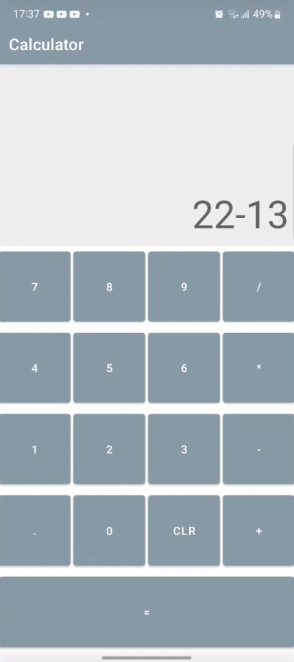

<h4 align="center">
  Calculator
</h4>

  <a href="#rocket-tecnologias">Technologies</a>&nbsp;&nbsp;&nbsp;|&nbsp;&nbsp;&nbsp;
  <a href="#-projeto">Project</a>

 

  

## :rocket: Technologies

This is a calculator made in Kotlin:

- [Kotlin](https://kotlinlang.org/)

- [Android Studio]([https://kotlinlang.org/](https://developer.android.com/studio?hl=pt&gclid=Cj0KCQjw1vSZBhDuARIsAKZlijQdCFfx4HCJJIgOwzPrkBqaXoGvx1mzBb43P9e_iOwU_XxVDyWuM4gaAgaREALw_wcB&gclsrc=aw.ds))

## 💻 Project

A simple calculator made in Kotlin for Android using Linear Layout.

  

